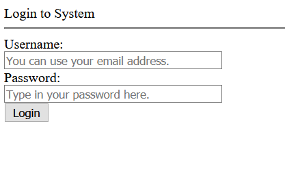

# WebFiori UI Package
A set of classes that provide basic web pages creation utilities in addition to creating the DOM of web pages.

<p align="center">
  <a href="https://github.com/WebFiori/ui/actions">
    
  </a>
  <a href="https://codecov.io/gh/WebFiori/ui">
    
  </a>
  <a href="https://sonarcloud.io/dashboard?id=WebFiori_ui">
      
  </a>
  <a href="https://github.com/WebFiori/ui/releases">
      
  </a>
  <a href="https://packagist.org/packages/webfiori/ui">
      
  </a>
</p>

## API Docs
This library is a part of <a href="https://github.com/usernane/webfiori">WebFiori Framework</a>. To access API docs of the library, you can visit the following link: https://webfiori.com/docs/webfiori/ui .

## Features
- Ability to create custom HTML UI Elements.
- Create and modify DOM through PHP.
- Provides a basic templating engine.

## Supported PHP Versions
The library support all versions starting from version 5.6 up to version 8.
  
## Usage
For more information on how to use the library, [check here](https://webfiori.com/learn/ui-package)

The very basic use case is to have HTML document with some text in its body. The class <a href="https://webfiori.com/docs/webfiori/ui/HTMLDoc">HTMLDoc</a> represent HTML document. What we have to do is simply to create an instance of this class, add a text to its body. Assuming that you have an autoloader to load your classes, the class can be used as follows:
``` php
use webfiori\ui\HTMLDoc;

$doc = new HTMLDoc();
$doc->getBody()->addTextNode('Hello World!');
echo $doc;
```

The output of this code is HTML 5 document. The structure of the document will be similar to the following HTML code:
``` html
<!DOCTYPE html>
<html>
  <head>
    <title>
      Default
    </title>
    <meta name="viewport" content="width=device-width, initial-scale=1.0, maximum-scale=1.0, user-scalable=no">
  </head>
  <body itemscope itemtype="http://schema.org/WebPage">
    Hello World!
  </body>
</html>
```
## Building More Complex DOM
To add more elements to the body of the document, the class <a href="https://webfiori.com/docs/webfiori/ui/HTMLNode">HMLNode</a> can be used to do that. It simply can be used to create any type of HTML element. The developer even can extend the class to create his own custom UI components. The library has already some pre-made components which are used in the next code sample. A list of the components can be found <a href="https://webfiori.com/docs/webfiori/ui">here</a>. The following code shows a code which is used to create a basic login form.

``` php
use webfiori\ui\HTMLDoc;

//Create new instance of "HTMLDoc".
$doc = new HTMLDoc();

// Build a login form.
$body = $doc->getBody();
$body->text('Login to System')->hr();

$form = $body->form(['method' => 'post', 'actiion' => 'https://example.com/login']);

$form->label('Username:');
$form->br();
$form->input('text', ['placeholder'=>'You can use your email address.', 'style' => 'width:250px']);
$form->br();
$form->label('Password:');
$form->br();
$form->input('password', ['placeholder' => 'Type in your password here.', 'style' => 'width:250px']);
$form->br();
$form->input('submit', ['value' => 'Login']);

echo $doc;
```

The output of the code would be similar to the following image.



## Loading HTML Files
Another way to have your HTML rendered as object of type HTMLDoc is to create your document fully in HTML and add slots within its body and set the values of the slots in your PHP code. For example, let's assume that we have HTML file with the following markup:
``` html
<!DOCTYPE html>
<html>
    <head>
        <title>{{page-title}}</title>
        <meta charset="UTF-8">
        <meta name="viewport" content="width=device-width, initial-scale=1.0">
        <meta name="description" content="{{page-desc}}">
    </head>
    <body>
        <section>
            <h1>{{page-title}}</h1>
            <p>
                Hello Mr.{{ mr-name }}. This is your visit number {{visit-number}} 
                to our website.
            </p>
        </section>
    </body>
</html>
```
If you notice, there are some strings which are between `{{}}`. Simply, any string between `{{}}` is called a slot. To fill the solts with values, we have to load HTML code into PHP. The following code shows how to do it.
``` php
$document = HTMLNode::loadComponent('my-html-file.html', [
    'page-title' => 'Hello Page',
    'page-desc' => 'A page that shows visits numbers.',
    'mr-name' => 'Ibrahim Ali',
    'visit-number' => 33,
]);
echo $document
```
The output of the above PHP code will be the following HTML code.
``` html
<!DOCTYPE html>
<html>
    <head>
        <title>Hello Page</title>
        <meta charset="UTF-8">
        <meta name="viewport" content="width=device-width, initial-scale=1.0">
        <meta name="description" content="A page that shows visits numbers.">
    </head>
    <body>
        <section>
            <h1>Hello Page</h1>
            <p>
                Hello Mr.Ibrahim Ali. This is your visit number 33
                to our website.
            </p>
        </section>
    </body>
</html>
```
## License
The library is licensed under MIT license.
